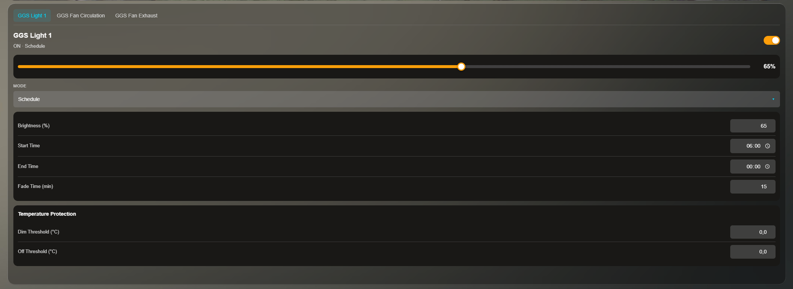

<p align="center">
  
</p>

Local bridge between the Spider Farmer GGS Controller and Home Assistant via MQTT Discovery.

A Raspberry Pi acts as a Wi-Fi hotspot for the GGS Controller, intercepts the encrypted MQTT traffic, normalizes the data, and exposes it to Home Assistant. The official Spider Farmer app and cloud keep working in parallel.

```
GGS Controller
     │  Wi-Fi (hotspot from the Pi)
     ▼
Raspberry Pi ──── TLS MITM Proxy :8883
     │                      │
     │  eth0 (LAN)      Mosquitto :1883
     │                      │
     ▼                      ▼
  SF Cloud            Home Assistant
  (app keeps          (entities auto-
   working)            discovered)
```

---

## What you get

Once the GGS Controller is connected, entities show up in HA automatically — depending on what's plugged into the controller:

| Type | Entities |
|------|----------|
| Sensor | Air Temperature, Humidity, VPD, CO₂, PPFD |
| Sensor | Soil Temperature / Humidity / EC (average + per-sensor) |
| Light | Light 1, Light 2 (on/off, brightness, modes: Manual / Schedule / PPFD) |
| Fan | Fan Exhaust (on/off + 0-100 % speed) |
| Fan | Fan Circulation (on/off + 0-10 speed levels) |
| Switch | Heater, Humidifier, Dehumidifier |
| Switch | Outlet 1-10 (count depends on which Power Strip is connected) |

Plus every mode-specific setting as its own sub-device entity (schedule brightness, PPFD target, fan cycle run-time, environment submode, …) — there's no setting in the SF App that's not also exposed in HA.

---

## Lovelace Card

Custom HA card that mirrors the SF App's per-device control with a tab per device, a mode dropdown, and the matching settings panel below:

<p align="center">
  
</p>

Three install paths (see **[Card install guide](spiderbridge/frontend/README.md)** for full details):

- **HA Addon (Option A below):** card auto-installs together with the addon. No extra clicks.
- **HACS:** add this repository as a custom Frontend repo, install **Spider Farmer GGS Card**.
- **Manual:** `npm run build`, copy file, register the resource.

In a dashboard:
```yaml
type: custom:ggs-card
```

---

## What hardware do I need?

| Part | What it does |
|---|---|
| Raspberry Pi with Wi-Fi (Pi 3, Pi 4, Pi 5, or Zero 2 W) | Runs as the bridge between the controller and HA |
| Ethernet cable | **Mandatory** — the Pi must reach your network over LAN because the Wi-Fi adapter is dedicated to the GGS hotspot |
| Spider Farmer GGS Controller | The thing you want to control (CB, PS5, PS10, or LC) |
| Home Assistant | On the same Pi or a separate device on the same network |

Two ways to set the Pi up:

- **Option A — Pi runs Home Assistant OS** and SpiderBridge is installed as an addon. Recommended for most users. Pi and HA are the same device.
- **Option B — Pi runs Raspberry Pi OS** with SpiderBridge as a standalone service. HA runs separately (second Pi, NUC, VM, whatever). The "classic" setup.

Pick one — the rest of the guide is split per option.

---

## Option A — HA Addon setup (recommended)

> **Prerequisite:** You already have Home Assistant OS installed on the Pi. If not yet — see https://www.home-assistant.io/installation/raspberrypi for the initial install, then come back here.

> **Make sure:** the Pi is connected to your router by **Ethernet cable**. The Wi-Fi interface is going to be used for the hotspot, so cabled internet is required.

### Step 1 — Add the repository in HA

1. Open **Home Assistant** in your browser.
2. Click your profile icon (bottom left) → make sure **"Advanced Mode"** is on (otherwise you can't see the full Add-on Store).
3. Sidebar: **Settings** → **Add-ons** → bottom right click **"Add-on Store"**.
4. Top right click **⋮ (three dots)** → **"Repositories"**.
5. In the popup paste this URL: `https://github.com/iceboerg00/spiderfarmer-bridge`
6. Click **Add** → **Close**.

### Step 2 — Install the addon

1. Scroll down in the Add-on Store → find the **"SpiderBridge Add-ons"** section → click **SpiderBridge**.
2. Click **Install** (takes 1-2 min — the Pi builds the card too).

### Step 3 — Configure

On the addon page open the **Configuration** tab. Fields:

| Field | What to enter |
|---|---|
| `ssid` | Name of the Wi-Fi for the GGS Controller, freely chosen (e.g. `GGS-Tent`) |
| `password` | Wi-Fi password, **at least 8 characters** (e.g. `SuperSafe123`) |
| `channel` | `6` is a safe default (any number from 1 to 11) |
| `hotspot_ip` | Leave at `192.168.10.1`, change only if that subnet is already used in your network |
| `device_name` | Anything, e.g. `GGS Tent`. Becomes the device name in HA. |
| `hotspot_enabled` | Leave at `true` (Pi runs the hotspot itself — recommended) |

Click **Save** (top right).

### Step 4 — Start the addon

1. Open the **Info** tab → click **Start**.
2. Enable **Watchdog** and **Start on boot** (so it comes back up automatically after a reboot).
3. Open the **Log** tab — you should see lines like `Hotspot enabled`, `Proxy listening on 0.0.0.0:8883`. If you see errors, jump to [Troubleshooting](#troubleshooting).

### Step 5 — Restart Home Assistant Core

**Settings → System → Restart** → **Restart Home Assistant Core**.

This is required for HA to pick up the SpiderBridge integration that the addon installed.

### Step 6 — Activate the integration

1. **Settings → Devices & services**.
2. Bottom right **+ Add Integration** → type **"SpiderBridge"** in the search → click it.
3. A single click on **Submit** — no extra input needed.

### Step 7 — Connect the GGS Controller

In the Spider Farmer app on your phone, switch the GGS Controller's Wi-Fi over to the network you created in Step 3 (the SSID + password from there). On first connect the MAC is auto-detected.

In the addon log you should see something like:

```
🕷  SpiderBridge — device detected
   MAC: 7C2C67F03DAC
   ID:  GGS Tent
```

Entities appear in HA from that moment on — usually within 10-20 seconds.

### Step 8 — Add the card to a dashboard

1. Hard-refresh the browser — **Ctrl+F5** (Mac: Cmd+Shift+R) — so HA loads the freshly installed card.
2. Open a dashboard → **Edit Dashboard** → **+ Add Card** → search "Spider Farmer" → done.

---

## Option B — Standalone Pi running Raspberry Pi OS

> **Prerequisite:** You have Raspberry Pi OS (64-bit) installed on the Pi and SSH access. If not yet — https://www.raspberrypi.com/software/ for the imager. Enable SSH in the imager options or by dropping an empty `ssh` file on the SD card.

> **Make sure:** Pi is connected to your router by **Ethernet cable**. Same reason as Option A.

### Step 1 — SSH to the Pi

On your main computer open a terminal:

```bash
ssh pi@<pi-ip>
```

(IP from your router's device list or via `nmap`. Default user is usually `pi` or whatever you set in the imager.)

### Step 2 — Run the one-line installer

On the Pi (in the SSH terminal):

```bash
curl -sSL https://raw.githubusercontent.com/iceboerg00/spiderfarmer-bridge/master/setup/bootstrap.sh | sudo bash
```

The installer:
1. Clones the repo to `/opt/spiderfarmer-bridge`.
2. Starts a setup wizard that asks for:
   - **SSID** — name of the Wi-Fi for the GGS Controller (e.g. `GGS-Tent`)
   - **Password** — at least 8 characters
   - **Device name** — keep "GGS" or pick your own
3. Sets up Mosquitto, Python venv, TLS certificates, and the pm2-managed services (`sf-proxy`, `sf-discovery`).
4. Configures the Wi-Fi hotspot with the stability tweaks the GGS Controller needs (powersave off, PMF disabled).

Takes 3-5 minutes. When it's done, `sudo pm2 status` should show two services online.

### Step 3 — Connect HA to the Pi

On your HA device:

1. **Settings → Devices & services**.
2. If **MQTT** isn't set up yet: **+ Add Integration** → MQTT → click.
3. In the configuration popup:
   - **Broker:** IP of the Pi (its Ethernet address, e.g. `192.168.1.100`)
   - **Port:** `1883`
   - **Username/Password:** leave empty
4. **Submit**.

If MQTT is already wired to a different broker: you can run two brokers in parallel, or define the Pi's broker as an additional one in YAML — see HA's MQTT docs.

### Step 4 — Connect the GGS Controller

In the Spider Farmer app, switch the controller's Wi-Fi to the network from the wizard.

Watch the logs on the Pi:

```bash
sudo pm2 logs sf-proxy --lines 50
```

A line like `🕷  SpiderBridge — device detected   MAC: ...` confirms it's working.

A few seconds later the entities show up in HA under the `device_name` from the wizard.

### Step 5 — Card on the dashboard

In Option B the card does **not** auto-install — use HACS or the manual route. See **[Card install guide](spiderbridge/frontend/README.md)** Option B or C.

---

## Updates

### Option A (addon)

1. **Settings → Add-ons → SpiderBridge** → if "Update available" shows, click **Update**.
2. Click **Restart**.
3. **Ctrl+F5** in the browser (the card may have updated too).

### Option B (standalone)

```bash
sudo git -C /opt/spiderfarmer-bridge pull
sudo pm2 restart sf-proxy sf-discovery
```

For the card after an update: HACS → "Spider Farmer GGS Card" → Update, or manually `npm run build` + copy the file again.

---

## Troubleshooting

### Controller doesn't connect to the hotspot
- The GGS Controller is 2.4 GHz only — pick a channel between 1 and 11.
- Option A: check the addon log for `AP-ENABLED`.
- Option B: `nmcli con show SF-Bridge-Hotspot | grep band`. Make sure `802-11-wireless.powersave` is `2` (disabled) — otherwise the controller drops daily.

### No data in Home Assistant
- Option A: addon log → look for `Proxy listening on 0.0.0.0:8883`.
- Option B: `sudo pm2 logs sf-proxy --lines 100`.
- Inspect MQTT topics directly:
  ```bash
  mosquitto_sub -h <pi-ip> -p 1883 -t 'spiderfarmer/#' -v
  ```

### HA outlet toggle doesn't switch the PS5/PS10
- The proxy needs to see one cloud→device packet first to learn the controller's MQTT topic prefix. Easiest trigger: tap one outlet once in the SF App on your phone — afterwards the prefix is locked for the session.
- `sudo pm2 logs sf-proxy | grep "DOWN topic prefix"` — once the line `DOWN topic prefix learned: PS (was CB)` appears, it's ready.

### Entities show as "unavailable"
- Heater / Humidifier / Dehumidifier appear only after the controller reports their state.
- Option A: **Restart** the addon.
- Option B: `sudo pm2 restart sf-discovery`.

### Card doesn't appear under "+ Add Card"
- Hard-refresh the browser — **Ctrl+F5**.
- HA → Settings → Dashboards → ⋮ → **Resources** → check that `/local/ggs-card.js` is listed as a JavaScript Module. If not: add it manually (URL `/local/ggs-card.js`, type "JavaScript Module").

### Integration disappears after addon update (Option A)
- After every addon update that touches the integration: **Settings → System → Restart Home Assistant Core**.

---

## Pro tips (Option B)

Services are managed by **pm2**, not systemd:

```bash
sudo pm2 status                       # service state
sudo pm2 logs sf-proxy                # live log
sudo pm2 logs sf-proxy --lines 200    # last 200 lines
sudo pm2 restart sf-proxy             # restart proxy
sudo pm2 restart sf-discovery         # restart discovery service
```

See every MQTT topic the bridge publishes:

```bash
mosquitto_sub -h localhost -p 1883 -t 'spiderfarmer/#' -v
```

Run the backend tests:

```bash
cd /opt/spiderfarmer-bridge
.venv/bin/pytest tests/ -v
```

---

## Supported modules

| Module | Sensors / Lights | Outlets | HA control |
|---|---|---|---|
| Control Box (CB) | Air, soil, CO₂, PPFD, lights, fans, climate accessories | — | full |
| Power Strip 5 (PS5) | Air sensors, lights, blower / fan | 5 | full |
| Power Strip 10 (PS10) | Air sensors, lights, blower / fan | 10 | full |
| Light Controller (LC) | 2 light channels with brightness, mode, PPFD | — | partial |

Multiple modules on the same controller work simultaneously — entities are auto-discovered for each.

---

## Project structure

```
spiderfarmer-bridge/
├── proxy/                 # MQTT parser, normalizer, command handler, MITM proxy
├── ha/                    # HA Discovery payloads + publisher
├── config/                # config.yaml, mosquitto.conf
├── setup/                 # bootstrap.sh, install.sh, wizard.sh, hotspot.sh
├── certs/                 # TLS certificates
├── tests/                 # backend tests (pytest)
├── docs/                  # README assets (screenshot, etc.)
├── spiderbridge/          # HA addon (Option A)
│   ├── config.yaml
│   ├── Dockerfile         # multi-stage build that includes the frontend
│   ├── app/               # Python code for the container
│   ├── frontend/          # Lovelace card (TypeScript + Lit)
│   ├── integration/       # HA custom integration (auto-installed by the addon)
│   └── rootfs/            # s6 service scripts + auto-install of the card
├── hacs.json              # HACS Frontend repo metadata
└── repository.yaml        # HA custom-repository metadata
```
